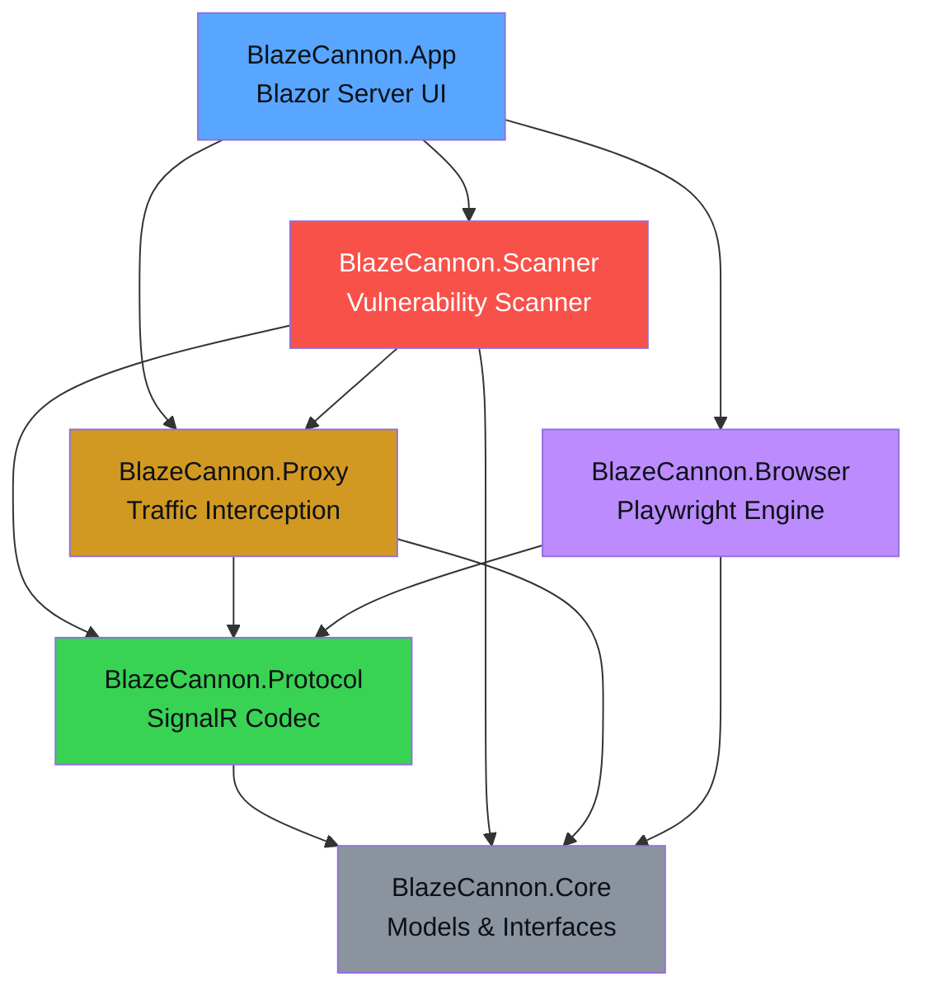

# BlazeCannon

A C# penetration testing framework specifically designed to test **Blazor Server** applications. Blazor Server uses SignalR over WebSockets with a custom binary protocol for dispatching browser events and receiving render batches. Almost no existing security tools support this protocol natively -- BlazeCannon fills that gap.

> **DISCLAIMER:** This tool is intended for **authorized penetration testing only**. Only use BlazeCannon against applications you own or have explicit written permission to test. Unauthorized access to computer systems is illegal.

## Architecture



## Projects

| Project | Description |
|---------|-------------|
| **BlazeCannon.Core** | Shared models, interfaces, and contracts |
| **BlazeCannon.Protocol** | SignalR/Blazor protocol encoder, decoder, event factory, and render batch parser |
| **BlazeCannon.Proxy** | WebSocket-level intercepting proxy for Blazor Server connections |
| **BlazeCannon.Scanner** | Automated vulnerability scanner with XSS, SQLi, Command Injection, and Path Traversal payloads |
| **BlazeCannon.Browser** | Playwright-based browser engine for full DOM interaction and WebSocket interception |
| **BlazeCannon.App** | Blazor Server UI dashboard with dark hacker theme |

## Features

- **Traffic Inspector** -- Real-time monitoring of SignalR/WebSocket messages between client and server, with protocol-aware decoding of Blazor message types (DispatchBrowserEvent, RenderBatch, OnLocationChanged, etc.)
- **Payload Workbench** -- Manual injection of crafted Blazor protocol messages with pre-built payload templates for XSS, SQLi, Command Injection, and Path Traversal
- **Vulnerability Scanner** -- Automated scanning that connects to the target's Blazor hub, navigates pages, injects payloads through event handlers, and analyzes server responses for evidence of vulnerabilities
- **Browser Engine** -- Chromium-based browser via Playwright for full DOM rendering, form field discovery, screenshot capture, and WebSocket traffic observation
- **Render Batch Parser** -- Binary parser for Blazor's render batch format to extract component trees, event handler IDs, and form elements

## Prerequisites

- [.NET 8.0 SDK](https://dotnet.microsoft.com/download/dotnet/8.0)
- [Playwright browsers](https://playwright.dev/dotnet/docs/intro) (for Browser Engine feature)

## Quick Start

### Local Development

```bash
# Clone and build
cd BlazeCannon
dotnet restore
dotnet build

# Install Playwright browsers (first time only)
pwsh BlazeCannon.Browser/bin/Debug/net8.0/playwright.ps1 install chromium

# Run the UI
dotnet run --project BlazeCannon.App
# Open http://localhost:5099
```

### Docker

```bash
docker build -t blazecannon .
docker run -p 8080:8080 blazecannon
# Open http://localhost:8080
```

## Usage

1. **Configure Target** -- Set the target URL and Blazor hub path on the Dashboard page
2. **Inspect Traffic** -- Use the Traffic Inspector to connect and observe SignalR messages in real-time
3. **Craft Payloads** -- Use the Payload Workbench to manually test specific event handlers with custom or template payloads
4. **Scan** -- Configure the Vulnerability Scanner with target pages and categories, then run an automated scan
5. **Browser** -- Launch the Browser Engine to interact with the target through a real Chromium instance while observing WebSocket traffic

## Built-in Payloads

| Category | Count | Examples |
|----------|-------|---------|
| XSS | 8 | Script injection, img onerror, SVG onload, attribute escape |
| SQL Injection | 8 | OR bypass, UNION, boolean-based, error-based, stacked queries |
| Command Injection | 8 | Semicolon/pipe/backtick chaining, whoami, passwd read |
| Path Traversal | 5 | Linux/Windows traversal, URL encoding, double encoding |

## How It Works

BlazeCannon operates at the **SignalR protocol level**, which is the transport layer Blazor Server uses for all client-server communication:

1. **Negotiates** a connection with the target's `/_blazor/negotiate` endpoint
2. **Establishes** a WebSocket connection using the connection token
3. **Performs** the SignalR handshake (JSON protocol, version 1)
4. **Decodes** all messages using the SignalR framing format (record separator `0x1E` delimited JSON)
5. **Injects** crafted `DispatchBrowserEvent` messages to simulate user input with malicious payloads
6. **Analyzes** server responses (render batches, invocations, completions) for evidence of vulnerabilities

## License

This project is for educational and authorized security testing purposes only.
