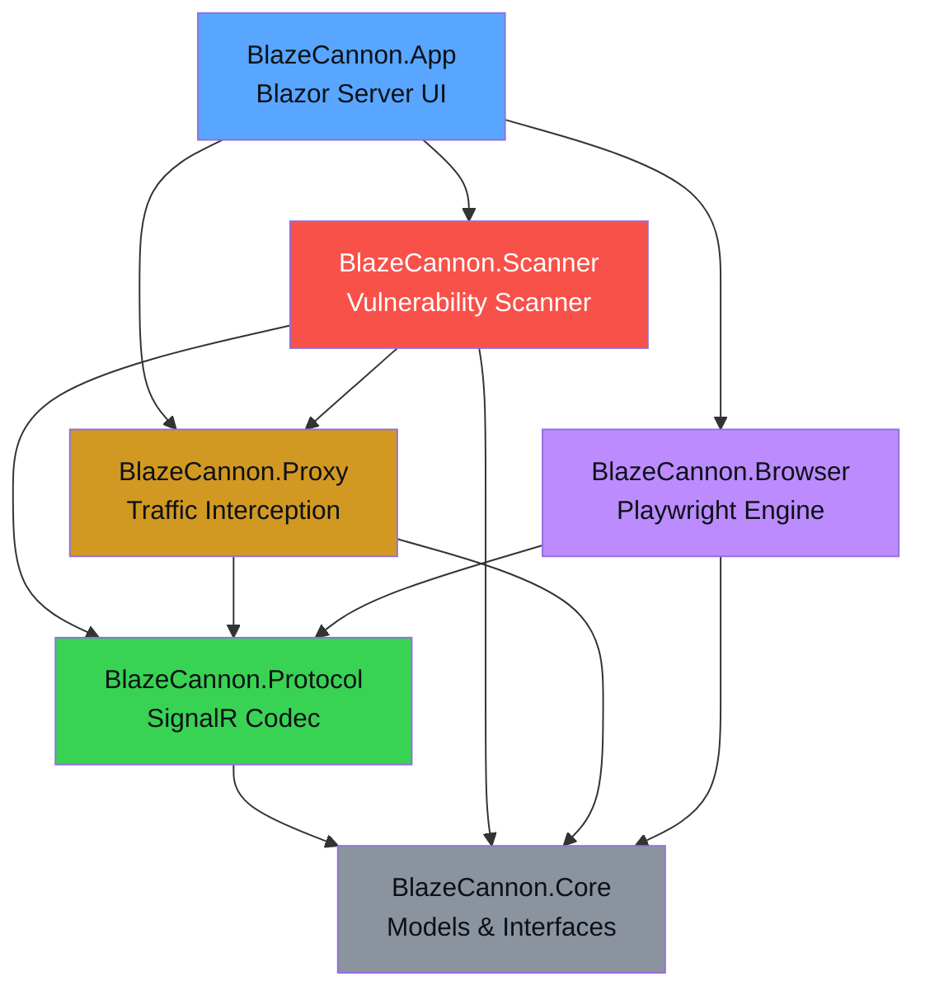
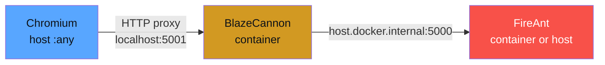

# BlazeCannon

A C# penetration testing framework specifically designed to test **Blazor Server** applications. Blazor Server uses SignalR over WebSockets with a custom binary protocol for dispatching browser events and receiving render batches. Almost no existing security tools support this protocol natively -- BlazeCannon fills that gap.

> **DISCLAIMER:** This tool is intended for **authorized penetration testing only**. Only use BlazeCannon against applications you own or have explicit written permission to test. Unauthorized access to computer systems is illegal.

## Architecture



## Projects

| Project | Description |
|---------|-------------|
| **BlazeCannon.Core** | Shared models, interfaces, and contracts |
| **BlazeCannon.Protocol** | SignalR/Blazor protocol encoder, decoder, event factory, and render batch parser |
| **BlazeCannon.Proxy** | WebSocket-level intercepting proxy for Blazor Server connections |
| **BlazeCannon.Scanner** | Automated vulnerability scanner with XSS, SQLi, Command Injection, and Path Traversal payloads |
| **BlazeCannon.Browser** | Playwright-based browser engine for full DOM interaction and WebSocket interception |
| **BlazeCannon.App** | Blazor Server UI dashboard with dark hacker theme |

## Features

- **Traffic Inspector** -- Real-time monitoring of SignalR/WebSocket messages between client and server, with protocol-aware decoding of Blazor message types (DispatchBrowserEvent, RenderBatch, OnLocationChanged, etc.)
- **Payload Workbench** -- Manual injection of crafted Blazor protocol messages with pre-built payload templates for XSS, SQLi, Command Injection, and Path Traversal
- **Vulnerability Scanner** -- Automated scanning that connects to the target's Blazor hub, navigates pages, injects payloads through event handlers, and analyzes server responses for evidence of vulnerabilities
- **Browser Engine** -- Chromium-based browser via Playwright for full DOM rendering, form field discovery, screenshot capture, and WebSocket traffic observation
- **Render Batch Parser** -- Binary parser for Blazor's render batch format to extract component trees, event handler IDs, and form elements

## Install

BlazeCannon ships in three flavors. Pick one:

| Platform | Artifact | How to get it |
|----------|----------|---------------|
| **Docker / Linux container** | OCI image | `docker pull ghcr.io/mathewulanowski/blazecannon:latest` |
| **Windows** | Self-contained `.exe` (no .NET install needed) | `blazecannon-vX.Y.Z-win-x64.exe` from the [Releases page](https://github.com/MathewUlanowski/BlazeCannon/releases) |
| **Linux** | Self-contained binary (no .NET install needed) | `blazecannon-vX.Y.Z-linux-x64.tar.gz` from the [Releases page](https://github.com/MathewUlanowski/BlazeCannon/releases) |

### Run — Docker

```bash
docker run -p 8080:8080 -p 5001:5001 ghcr.io/mathewulanowski/blazecannon:latest
# UI:    http://localhost:8080
# Proxy: http://localhost:5001
```

### Run — Windows standalone

Download the `.exe` and run it directly — everything is bundled:

```powershell
.\blazecannon-v0.3.1-win-x64.exe
# UI:    http://localhost:8080
# Proxy: http://localhost:5001
```

### Run — Linux standalone

```bash
tar -xzf blazecannon-v0.3.1-linux-x64.tar.gz
./BlazeCannon.App
# UI:    http://localhost:8080
# Proxy: http://localhost:5001
```

Override the default ports with environment variables:

```bash
BLAZECANNON_UI_PORT=9000 BLAZECANNON_PROXY_PORT=9001 ./BlazeCannon.App
```

> **Playwright browsers** — the Browser Engine downloads Chromium to `~/.cache/ms-playwright` on first use. The Docker image ships with Chromium pre-installed; standalone builds fetch it on demand.

## Build from source

```bash
# Clone and build
git clone https://github.com/MathewUlanowski/BlazeCannon.git
cd BlazeCannon
dotnet restore
dotnet build

# Install Playwright browsers (first time only)
pwsh BlazeCannon.Browser/bin/Debug/net8.0/playwright.ps1 install chromium

# Run the UI
dotnet run --project BlazeCannon.App
# Open http://localhost:8080
```

**Prerequisites for building:** [.NET 8.0 SDK](https://dotnet.microsoft.com/download/dotnet/8.0)

### Pointing Chromium at the proxy

Launch an isolated Chrome window routed through the BlazeCannon proxy (won't touch your main profile):

```bash
chrome.exe \
  --proxy-server="http://localhost:5001" \
  --user-data-dir="%TEMP%\blazecannon-chrome-profile" \
  --ignore-certificate-errors \
  --no-first-run --no-default-browser-check --new-window \
  about:blank
```

### Reaching a target running on the host (e.g. FireAnt)

From **inside** the BlazeCannon container, `localhost` refers to the container itself. To reach a target running on the Docker host:

| Scenario | Host address to use from container |
|----------|------------------------------------|
| Docker Desktop (Windows/Mac) | `http://host.docker.internal:<port>` |
| Linux (default bridge) | `http://172.17.0.1:<port>` |
| Another container on a shared user-defined network | `http://<container-name>:<port>` |

Example: if FireAnt is running via `docker run -p 5000:5000 fireant`, the BlazeCannon container reaches it at `http://host.docker.internal:5000`.



## Usage

1. **Configure Target** -- Set the target URL and Blazor hub path on the Dashboard page
2. **Inspect Traffic** -- Use the Traffic Inspector to connect and observe SignalR messages in real-time
3. **Craft Payloads** -- Use the Payload Workbench to manually test specific event handlers with custom or template payloads
4. **Scan** -- Configure the Vulnerability Scanner with target pages and categories, then run an automated scan
5. **Browser** -- Launch the Browser Engine to interact with the target through a real Chromium instance while observing WebSocket traffic

## Built-in Payloads

| Category | Count | Examples |
|----------|-------|---------|
| XSS | 8 | Script injection, img onerror, SVG onload, attribute escape |
| SQL Injection | 8 | OR bypass, UNION, boolean-based, error-based, stacked queries |
| Command Injection | 8 | Semicolon/pipe/backtick chaining, whoami, passwd read |
| Path Traversal | 5 | Linux/Windows traversal, URL encoding, double encoding |

## How It Works

BlazeCannon operates at the **SignalR protocol level**, which is the transport layer Blazor Server uses for all client-server communication:

1. **Negotiates** a connection with the target's `/_blazor/negotiate` endpoint
2. **Establishes** a WebSocket connection using the connection token
3. **Performs** the SignalR handshake (JSON protocol, version 1)
4. **Decodes** all messages using the SignalR framing format (record separator `0x1E` delimited JSON)
5. **Injects** crafted `DispatchBrowserEvent` messages to simulate user input with malicious payloads
6. **Analyzes** server responses (render batches, invocations, completions) for evidence of vulnerabilities

## Releases

Every push builds and publishes via GitHub Actions. The convention:

| Branch | Release type | Tag format | Docker tags |
|--------|--------------|------------|-------------|
| `main` | Stable release | `v{version}` (e.g. `v0.2.0`) | `:latest`, `:{version}`, `:v{version}` |
| Any other | Pre-release | `v{version}-{branch}.{run}` | `:{branch}`, `:v{version}-{branch}.{run}` |

`{version}` comes from `<Version>` in `Directory.Build.props`. **Bump it before merging to `main`** — the workflow fails the build if `v{version}` already exists as a tag.

Images are pushed to GitHub Container Registry:

```
ghcr.io/mathewulanowski/blazecannon:latest
ghcr.io/mathewulanowski/blazecannon:v0.2.0
```

Each release also gets a zipped `linux-x64` publish build attached.

```mermaid
graph LR
    Push[Push commit] --> Which{Branch?}
    Which -->|main| Stable[Stable release<br/>v{version}]
    Which -->|feature-x| Pre[Pre-release<br/>v{version}-feature-x.{run}]
    Stable --> GHCR[(GHCR<br/>:latest, :vX.Y.Z)]
    Stable --> GHR1[GitHub Release<br/>prerelease=false]
    Pre --> GHCR2[(GHCR<br/>:feature-x)]
    Pre --> GHR2[GitHub Release<br/>prerelease=true]

    style Stable fill:#39d353,color:#0d1117
    style Pre fill:#d29922,color:#0d1117
```

## License

This project is for educational and authorized security testing purposes only.
