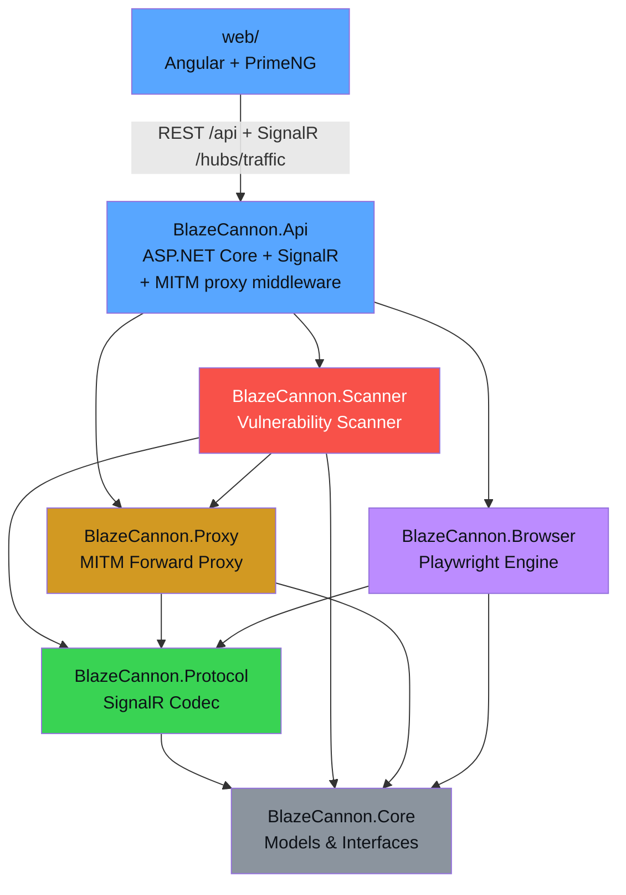
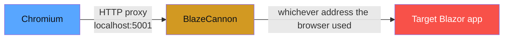

# BlazeCannon

A C# penetration testing framework specifically designed to test **Blazor Server** applications. Blazor Server uses SignalR over WebSockets with a custom binary protocol for dispatching browser events and receiving render batches. Almost no existing security tools support this protocol natively -- BlazeCannon fills that gap.

> **DISCLAIMER:** This tool is intended for **authorized penetration testing only**. Only use BlazeCannon against applications you own or have explicit written permission to test. Unauthorized access to computer systems is illegal.

## Architecture

BlazeCannon is a headless .NET API + SignalR hub with an Angular frontend. The backend hosts the MITM proxy on its own port; the frontend talks to the API over REST for reads/writes and over the SignalR hub for live traffic.



## Projects

| Project | Description |
|---------|-------------|
| **BlazeCannon.Core** | Shared models, interfaces, and contracts |
| **BlazeCannon.Protocol** | SignalR/Blazor protocol encoder, decoder, event factory, and render batch parser |
| **BlazeCannon.Proxy** | WebSocket-level MITM forward proxy middleware for Blazor Server connections |
| **BlazeCannon.Scanner** | Automated vulnerability scanner with XSS, SQLi, Command Injection, and Path Traversal payloads |
| **BlazeCannon.Browser** | Playwright-based browser engine for full DOM interaction and WebSocket interception |
| **BlazeCannon.Api** | ASP.NET Core Web API + SignalR hub. Exposes `/api/*` endpoints and the `/hubs/traffic` hub; hosts the MITM proxy on its own port |
| **web/** | Angular 17 frontend (PrimeNG + `@microsoft/signalr`). Consumes the API + hub |

## Features

- **Traffic Inspector** -- Real-time monitoring of SignalR/WebSocket messages between client and server, with protocol-aware decoding of Blazor message types (DispatchBrowserEvent, RenderBatch, OnLocationChanged, etc.)
- **Payload Workbench** -- Manual injection of crafted Blazor protocol messages with pre-built payload templates for XSS, SQLi, Command Injection, and Path Traversal
- **Vulnerability Scanner** -- Automated scanning that connects to the target's Blazor hub, navigates pages, injects payloads through event handlers, and analyzes server responses for evidence of vulnerabilities
- **Browser Engine** -- Chromium-based browser via Playwright for full DOM rendering, form field discovery, screenshot capture, and WebSocket traffic observation
- **Render Batch Parser** -- Binary parser for Blazor's render batch format to extract component trees, event handler IDs, and form elements

## Install

BlazeCannon ships in three flavors. Pick one:

| Platform | Artifact | How to get it |
|----------|----------|---------------|
| **Docker / Linux container** | OCI image | `docker pull ghcr.io/mathewulanowski/blazecannon:latest` |
| **Windows** | Self-contained `.exe` (no .NET install needed) | `blazecannon-vX.Y.Z-win-x64.exe` from the [Releases page](https://github.com/MathewUlanowski/BlazeCannon/releases) |
| **Linux** | Self-contained binary (no .NET install needed) | `blazecannon-vX.Y.Z-linux-x64.tar.gz` from the [Releases page](https://github.com/MathewUlanowski/BlazeCannon/releases) |

### Run — Docker

```bash
docker run -p 8080:8080 -p 5001:5001 ghcr.io/mathewulanowski/blazecannon:latest
# UI:    http://localhost:8080
# Proxy: http://localhost:5001
```

### Run — Windows standalone

Download the `.exe` and run it directly — everything is bundled:

```powershell
.\blazecannon-v0.4.0-win-x64.exe
# API + UI: http://localhost:8080
# MITM proxy: http://localhost:5001
```

### Run — Linux standalone

```bash
tar -xzf blazecannon-v0.4.0-linux-x64.tar.gz
./BlazeCannon.Api
# API + UI: http://localhost:8080
# MITM proxy: http://localhost:5001
```

Override the default ports with environment variables:

```bash
BLAZECANNON_UI_PORT=9000 BLAZECANNON_PROXY_PORT=9001 ./BlazeCannon.Api
```

> **Playwright browsers** — the Browser Engine downloads Chromium to `~/.cache/ms-playwright` on first use. The Docker image ships with Chromium pre-installed; standalone builds fetch it on demand.

## Build from source

**Prerequisites:** [.NET 8.0 SDK](https://dotnet.microsoft.com/download/dotnet/8.0), Node.js 20+.

```bash
git clone https://github.com/MathewUlanowski/BlazeCannon.git
cd BlazeCannon

# Install Playwright browsers (first time only)
dotnet restore
dotnet build
pwsh BlazeCannon.Browser/bin/Debug/net8.0/playwright.ps1 install chromium
```

### Dev — run the backend and frontend side-by-side

```bash
# Terminal 1 — API + SignalR hub (:8080) + MITM proxy (:5001)
dotnet run --project BlazeCannon.Api --configuration Release

# Terminal 2 — Angular dev server (:4200), proxies /api + /hubs → :8080
cd web
npm install   # first time only
npm start
# Open http://localhost:4200/
```

The Angular dev proxy (`web/proxy.conf.json`) forwards `/api/**` and `/hubs/**` to the .NET API with WebSocket upgrades enabled, so you get live SignalR traffic during development.

### Production build

```bash
dotnet publish BlazeCannon.Api/BlazeCannon.Api.csproj -c Release -r <rid> \
  --self-contained true -p:PublishSingleFile=true \
  -p:IncludeAllContentForSelfExtract=true -p:EnableCompressionInSingleFile=true
# Angular bundle:
cd web && npm run build
```

### Pointing Chromium at the proxy

Launch an isolated Chrome window routed through the BlazeCannon proxy (won't touch your main profile):

```powershell
# Windows
& "C:\Program Files\Google\Chrome\Application\chrome.exe" `
  --proxy-server="http://localhost:5001" `
  --proxy-bypass-list="<-loopback>" `
  --user-data-dir="$env:TEMP\blazecannon-chrome-profile" `
  --ignore-certificate-errors `
  --no-first-run --no-default-browser-check --new-window `
  about:blank
```

```bash
# macOS / Linux
chrome \
  --proxy-server="http://localhost:5001" \
  --proxy-bypass-list="<-loopback>" \
  --user-data-dir="/tmp/blazecannon-chrome-profile" \
  --ignore-certificate-errors \
  --no-first-run --no-default-browser-check --new-window \
  about:blank
```

> **`--proxy-bypass-list="<-loopback>"` is important.** Chrome's default bypass list excludes `localhost` and `127.0.0.1` from any configured proxy. If your target runs on the host loopback (e.g. a local `http://localhost:5000` Blazor app), omit this flag and the browser will skip the proxy entirely — traffic won't reach BlazeCannon.

### Reaching the target from BlazeCannon

The MITM proxy forwards HTTP/WebSocket to whatever host your browser tried to reach. How you name that host in the browser depends on where BlazeCannon is running:

| BlazeCannon runtime | Target lives on | Browser address |
|---------------------|-----------------|-----------------|
| Native (`dotnet run` or standalone binary) | Same machine | `http://localhost:<port>` — requires `--proxy-bypass-list="<-loopback>"` (see above) |
| Docker container (Desktop, Win/Mac) | Docker host | `http://host.docker.internal:<port>` |
| Docker container (Linux default bridge) | Docker host | `http://172.17.0.1:<port>` |
| Docker container on a user-defined network | Another container | `http://<container-name>:<port>` |



## Usage

1. Start BlazeCannon, then open the UI (http://localhost:8080 for a release build, http://localhost:4200 for the Angular dev server).
2. Launch an isolated Chrome pointed at the proxy (see [Pointing Chromium at the proxy](#pointing-chromium-at-the-proxy)) and navigate to your target.
3. **Dashboard** — confirm proxy status, active sessions, and captured message count.
4. **Traffic Inspector** — filter by direction / type / substring; reorder columns; arrow keys move the selection row by row; export JSON or CSV; **Stage for Replay** sends a message to the Replay queue.
5. **Replay** — pick a staged message, optionally edit its text payload, and send it back through the live MITM WebSocket session to observe how the target reacts.

> Scanner, Payload Workbench, and Browser Engine are placeholder routes in the Angular UI — the backend services still exist (they're reachable via the API) but the frontend ports are deferred to a later release.

## Built-in Payloads

| Category | Count | Examples |
|----------|-------|---------|
| XSS | 8 | Script injection, img onerror, SVG onload, attribute escape |
| SQL Injection | 8 | OR bypass, UNION, boolean-based, error-based, stacked queries |
| Command Injection | 8 | Semicolon/pipe/backtick chaining, whoami, passwd read |
| Path Traversal | 5 | Linux/Windows traversal, URL encoding, double encoding |

## How It Works

BlazeCannon operates at the **SignalR protocol level**, which is the transport layer Blazor Server uses for all client-server communication:

1. **Negotiates** a connection with the target's `/_blazor/negotiate` endpoint
2. **Establishes** a WebSocket connection using the connection token
3. **Performs** the SignalR handshake (JSON protocol, version 1)
4. **Decodes** all messages using the SignalR framing format (record separator `0x1E` delimited JSON)
5. **Injects** crafted `DispatchBrowserEvent` messages to simulate user input with malicious payloads
6. **Analyzes** server responses (render batches, invocations, completions) for evidence of vulnerabilities

## Releases

Every push builds and publishes via GitHub Actions. The convention:

| Branch | Release type | Tag format | Docker tags |
|--------|--------------|------------|-------------|
| `main` | Stable release | `v{version}` (e.g. `v0.2.0`) | `:latest`, `:{version}`, `:v{version}` |
| Any other | Pre-release | `v{version}-{branch}.{run}` | `:{branch}`, `:v{version}-{branch}.{run}` |

`{version}` comes from `<Version>` in `Directory.Build.props`. **Bump it before merging to `main`** — the workflow fails the build if `v{version}` already exists as a tag.

Images are pushed to GitHub Container Registry:

```
ghcr.io/mathewulanowski/blazecannon:latest
ghcr.io/mathewulanowski/blazecannon:v0.4.0
```

Each release attaches a `blazecannon-<tag>-win-x64.exe` (single-file, no unzip) and a `blazecannon-<tag>-linux-x64.tar.gz`.

```mermaid
graph LR
    Push[Push commit] --> Which{Branch?}
    Which -->|main| Stable[Stable release<br/>v{version}]
    Which -->|feature-x| Pre[Pre-release<br/>v{version}-feature-x.{run}]
    Stable --> GHCR[(GHCR<br/>:latest, :vX.Y.Z)]
    Stable --> GHR1[GitHub Release<br/>prerelease=false]
    Pre --> GHCR2[(GHCR<br/>:feature-x)]
    Pre --> GHR2[GitHub Release<br/>prerelease=true]

    style Stable fill:#39d353,color:#0d1117
    style Pre fill:#d29922,color:#0d1117
```

## License

This project is for educational and authorized security testing purposes only.
